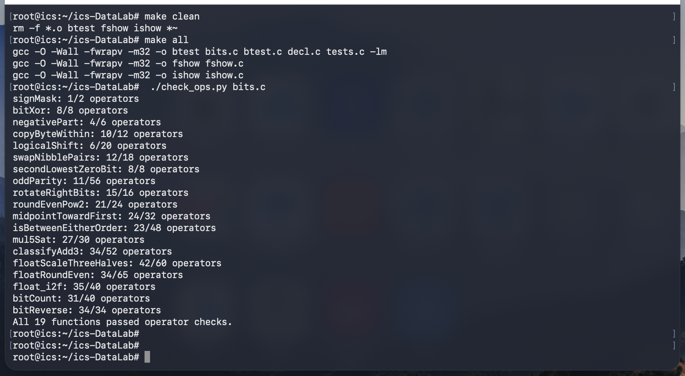
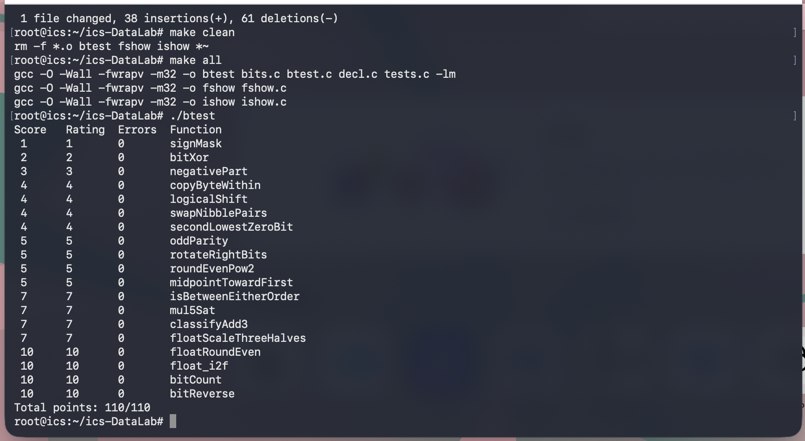

DataLab实验报告
## 实验结果
在终端中执行 `./check_ops.py bits.c` 后通过的截图：

在终端中执行 `./btest` 后通过的截图：

## 解题思路
#### P1 SignMask
输出最高位为1的数，即把1左移31位。
#### P2 bitXor
返回x异或y，即：`(~x&y)|(x&~y)`，但题目要求仅用~与&，又`a|b=~((~a)&(~b))`，所以`~(~(~x&y)&~(x&~y))`即为所求。
#### P3 negativePart
用x的符号位构造掩码m，因为`-x=~x+1`，对x使用掩码，返回`~(x&m)+1`，于是使得如果x为正则返回0，符合题意。
#### P4 copyByteWithin
首先把src移到最低位`y=x>>(src<<3)`，接下来取出最低两位`y=y&0xFF`，接下来清除byte dst位置的数字,`x=x&~(0xFF<<(dst<<3))`，最后补上`src x=x+(y<<(dst<<3))`。注意加法+的优先级高于位移。
#### P5 logicalShift
构造掩码a，使得a的左边n位为0且其他位为1。因为1<<31是负数，算数右移前面补1，右移n位则前面有n+1个1，因此左移一位，然后取补。于是`(x>>n)&a`只保留x右移后的部分，清除了符号位，即为所求。
#### P6 swapNibblePairs
首先构造掩码`0xF0F0F0F0`，由于常数大小限制，通过`mask = 0xF0 | (0xF0 << 8); mask = mask | (mask << 16)`方法构造。接下来通过mask让x每byte的后4bits左移4位，与x每byte的前4bits右移4位并且清除可能产生的符号位之后的结果作或，即为所求。
#### P7 secondLowestZeroBit
找x的倒数第二个0，也即找~x的倒数第二个1.执行x+1一定会让x的最后一个0变成1，`~x&(x+1)`能够把这个位置标注成1.通过`y=~x^(~x&(x+1))`把~x的最后一个1变成0，于是就变成找y的最后一个1.同理，执行~y+1一定会让~y的最后一个0变成1，`y&(~y+1)`，能够把这个位置标注成1，这个掩码即为所求。
#### P8 oddParity
题目要求，如果1的数量是偶数，返回1，如果奇数，返回0.注意到若干个0或1一起做异或，返回值和1的数量的奇偶有关，如果有偶数个1，返回0，奇数返回1.因此，按照依次折半的方法对x的全部位做异或：依次做`x=x^(x>>16、8、4、2、1)`;对结果取~再取最低位即可。
#### P9 rotateRightBits
首先构造t=(~n+1)&31，即-n模32的值，使在n>0时有t=32-n，在n=0时有t=0.接下来同P5，构造掩码a，a的左边n位为0且其他位为1，y则为x的后32-n位逻辑右移的结果。构造z，用来将x的后n位向左移t位移到最前面。y|z即为结果。
#### P10 roundEvenPow2
记2^(n-1)为half，x/2^n余数为r，则`return x-r+(条件判断)2^n`。能够加2^n的条件是r>half或者(r=half并且(x-r)/2^n为奇数，这样再加上2^n，商就为偶数了)，这个条件可以变成，r+half>=2^n并且((r不等于half)或者(x/2^n为奇数))，于是定义`up=((r+half)>>n) & ((!!(r^half))|((x>>n)&1))`，最后返回`x - r + (up << n)`即可。
#### P11 midpointTowardFirst
思路是首先求出可能的较小的答案，即(x+y)/2向下取整的结果，再根据条件判断是否要+1.(x+y)/2的向下取整等于x/2的向下取整加上y/2的向下取整再加1如果x和y都为奇数，即`(x>>1)+(y>>1)+((x&1)&(y&1))`，+1的条件是x+y为奇数，并且(x正y负（避免溢出）或者x-y>0).
#### P12 isbetweenEitherOrder
思路是x-a和x-b异号或x=a或x=b时返回1，否则返回0.但由于避免溢出，x-a为负的条件是，(xa异号并且x为负)或者(xa同号并且x-a为负)，x-b时同理。
#### P13 mul5Sat
要求返回x\*5，并且如果x溢出，返回相应的最值。思路是首先判断x\*4即x<<2是否溢出，再判断x\*5是否溢出。注意到只有当x的最高三位为111或000时，x<<2才不溢出，所以`top=(x>>29)&7`取出最高三位，`ov4=!!((top^(top>>1))&3)`表示x<<2时是否溢出。接下来通过x\*4和x\*5的符号位是否相同判断x\*5是否溢出，如果ov4没有溢出，那么x和x\*4必定同号，ov5仅检验x\*4+x后是否发生了溢出。`sign=x>>31`取符号位，通过`sat=(sign& min)|(~sign&max)`组织如果发生溢出后取的值。`ov=ov4|ov5`，`mask=~ov+1`，返回`(mask&sat)|(~mask&z)`即可。
#### P14 classifyAdd3
思路是将三数相加拆成两步，先计算 x+y=s，再计算 s+z=t，分别判断每一步是否发生有符号溢出，并将两步的溢出方向相加得到最终结果。对于两个数相加，只有当两个加数同号，而结果与加数异号时，才发生有符号溢出。
因此，先通过`sx=x>>31`、`sy=y>>31`和`ss=s>>31`获取符号位。若x、y均为正数而s为负数，则 pos1=1；若x、y均为负数而s为非负数，则 neg1=1。通过 `o1=pos1+(~neg1+1)`，将第一次加法的溢出分类为正溢出 1、负溢出 -1 或无溢出 0。接下来，用同样的方法判断第二步 s+z 是否溢出：通过 ss、sz 和 st 的符号位，分别判断正溢出 pos2 和负溢出 neg2，并得到 o2。最后返回 o1+o2，即为最终的溢出分类。
注意，第一次加法即使发生溢出，仍然可以继续使用其32位结果s参与第二次加法。由于加法的溢出量以 2^32为单位，第一次和第二次溢出的方向相反时可以相互抵消；因此，将两步的溢出分类相加，仍能判断精确数学和是否超出整数范围。
#### P15 floatScaleThreeHalves
思路是先提取符号位、指数位和尾数位，根据指数判断输入属于 NaN/无穷大、非规格化数还是规格化数，再分别计算 $f\times \frac{3}{2}$，并按照最近偶数舍入规则处理结果。
首先，若 `exp==0xFF`，说明输入是 NaN 或无穷大，直接返回原值。对于 `exp==0` 的非规格化数或正负零，实际数值为 $(−1)^S\times frac\times 2^{−149}$。乘以 $\frac{3}{2}$ 后，相当于将尾数乘以 3，再除以 2。因此，先计算 `product=frac+(frac<<1)`，再通过 `val=product>>1` 得到整数部分。若被舍弃的部分恰好为一半，即 `product&1` 为1，则当 `val` 为奇数时加1，使结果舍入到偶数。若 `val` 达到 `0x800000`，说明结果已经进入规格化数范围，需要将指数设为1，并从 `val` 中减去隐藏位 `0x800000`，得到新的尾数。
对于规格化数，实际有效数为 `sig=frac|0x800000`，其中最高位的1是隐藏位。将有效数乘以3，得到 `product=sig+(sig<<1)`。由于原数已经是规格化数，需要根据乘积的大小决定结果的指数是否增加：
- 若 `product<0x2000000`，说明乘以1.5后有效数仍未达到需要进位的范围，指数保持不变，结果有效数为 `product/2`。因此使用 `val=product>>1`，并根据被舍弃的最低位执行最近偶数舍入。
- 若 `product>=0x2000000`，说明有效数需要右移两位并将指数加1，因此执行 `exp++`、`val=product>>2`。此时被舍弃的是最低两位，故通过 `rem=product&3` 取得余数：若 `rem>2`，说明超过一半，应进位；若 `rem==2` 且 `val` 为奇数，也应进位，以满足最近偶数舍入规则。
最后，若指数增加后达到 `0xFF`，结果溢出为正无穷大或负无穷大，返回 `sign|0x7F800000`；否则取 `val` 的低23位作为新尾数，与符号位和指数位组合，即得到最终结果。
需要注意，非规格化数分支中的 `val` 可以跨过 `0x800000`，从而转为规格化数；而规格化数分支中，指数增加可能导致结果变为无穷大。这两种情况都需要单独处理。
#### P16 floatRoundEven
思路是先根据指数判断浮点数的范围，对需要舍入的数提取整数部分和小数部分，按照最近偶数规则舍入，最后将整数重新编码为浮点数。
首先，若 `exp==0xFF`，说明输入是 NaN 或无穷大，直接返回原值。若 `exp<126`，则绝对值小于 0.5，舍入结果为保留原符号的零。若 `exp==126`，则绝对值在 0.5 到 1 之间：恰好为 0.5 时舍入为偶数0，否则舍入为1。若 `exp>=150`，则绝对值至少为$2^{23}$，浮点数已经没有小数部分，直接返回原值。
对于其他情况，先恢复隐藏位，得到 `sig=0x800000|frac`。根据指数计算右移位数 `shift=150-exp`，通过 `intpart=sig>>shift` 得到整数部分，并利用 `rem` 和 `half` 判断被舍弃的部分是否超过一半或恰好为一半。若超过一半，或者恰好一半且整数部分为奇数，则将 `intpart` 加1，实现最近偶数舍入。
最后，通过循环找到整数部分最高的1所在的位置 `msb`，据此构造新的指数位 `((msb+127)<<23)`，并将整数有效位左移至浮点数尾数对应的位置。最后将符号位、指数位和尾数位按位或组合，得到舍入后的浮点数表示。
#### P17 float_i2f
思路是先提取整数的符号和绝对值，再找到最高位的1，以此确定浮点数的指数和有效数，最后根据有效位是否超过24位决定是否需要舍入。
首先，若 `x==0`，直接返回0。若 `x<0`，记录符号位，并通过 `~x+1` 求出绝对值；否则直接使用x。接下来通过循环不断右移 `absx`，找到最高位的1所在的位置 `msb`，从而得到指数位 `exp=(msb+127)<<23`。
- 若 `msb<=23`，说明整数的有效位不超过24位（包括隐藏的最高位1），无需舍入。将绝对值左移至有效数的最高位对齐位置，取低23位作为尾数即可。
- 若 `msb>23`，则需要右移 `shift=msb-23` 位，保留24位有效数，并通过 `rem` 和 `half` 判断被舍弃的部分。若超过一半，或者恰好一半且保留部分为奇数，则将 `sig` 加1，实现最近偶数舍入。
最后，若舍入导致 `sig` 变成 `0x1000000`，说明有效数多出一位，需要将其右移一位，并将指数加1。然后提取低23位作为尾数，与符号位、指数位组合，即得到最终的单精度浮点数表示。
#### P18 bitCount
思路是采用分组统计的方法，从每一位开始，依次统计每2位、4位、8位、16位中1的个数，最后将所有分组的计数相加，得到整个32位整数中1的总数。
首先构造掩码 `mask1=0x55555555`，其二进制形式为每隔一位出现一个1。通过 `x=(x&mask1)+((x>>1)&mask1)`，将每两位中1的个数统计到对应的两位中。接下来，利用 `mask2=0x33333333` 将相邻的两组计数相加，得到每4位中1的个数；再利用 `mask3=0x0F0F0F0F` 将相邻的4位计数相加，得到每个字节中1的个数。
最后，构造掩码 `a=0x00FF00FF` 和 `b=0x0000FFFF`，分别将相邻字节、相邻的16位中的计数相加。经过这些步骤，原来分散在32位中的计数逐渐汇总，最终得到整个整数中1的总数。
注意，这种方法不需要逐位检查，而是通过掩码和加法并行统计各个分组中的1的数量，因此效率较高。
#### P19 bitReverse
思路是采用分组交换的方法，依次交换相邻的1位、2位、4位、8位，最后交换左右16位，从而实现32位二进制数的整体逆序。
首先构造掩码 `mask16=0x00FFFF`，再通过异或和移位依次构造 `mask8`、`mask4`、`mask2` 和 `mask1`，分别用于标记交换过程中需要保留的对应位。由于常数大小有限制，因此通过已有掩码移位并结合异或，构造出不同间隔的掩码。
接下来，先通过 `mask1` 将相邻的两位交换，再通过 `mask2` 将相邻的两组2位交换，接着通过 `mask4` 交换相邻的4位组，最后通过 `mask8` 交换相邻的8位组。每一步都将一部分位左移、另一部分位右移，再通过按位或合并，从而逐步改变每组内部及组间的位顺序。
最后，将此时的高16位与低16位交换，得到整个32位整数的逆序结果。经过这五步交换，原来从左到右的位顺序就变成了从右到左。